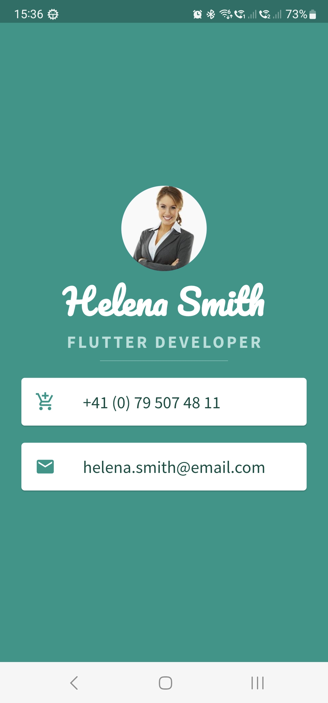

# The Complete Development Bootcamp
**By [The App Brewery](https://www.appbrewery.co/).**

Course followed on [Udemy](https://www.udemy.com/course/flutter-bootcamp-with-dart). These are the Android applications that I coded while following the course.

### [I Am Rich](./IAmRich/)
An app to show people how rich I am.

### [I Am Poor](./IAmPoor)
An app to show people how poor I am.

### [MiCard](./MiCard/)
A personal business card.

### [Dicee](./Dicee/)
An app that throws the dices.

