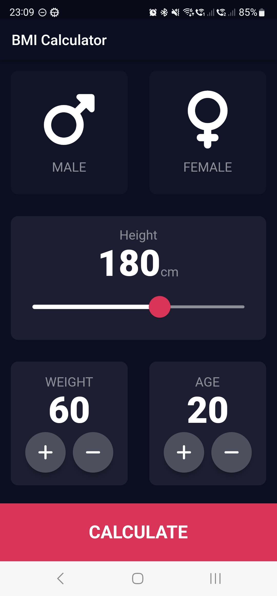

# The Complete Development Bootcamp
**By [The App Brewery](https://www.appbrewery.co/).**

Course followed on [Udemy](https://www.udemy.com/course/flutter-bootcamp-with-dart). These are the Android applications that I coded while following the course. See the [official course resources](https://github.com/londonappbrewery/Flutter-Course-Resources).

### [I Am Rich](./IAmRich/)
An app to show people how rich I am.

### [I Am Poor](./IAmPoor)
An app to show people how poor I am.

### [MiCard](./MiCard/)
A personal business card.

### [Dicee](./Dicee/)
An app that throws the dices.

### [Magic 8 Ball](./Magic8Ball/)
An app that has the answer to any question.

### [Xylophone](./Xylophone//)
An app where you can play xylophone.

### [Quizzler](./Quizzler/)
An app where your knowledge is getting tested.

### [Destini](./Destini/)
An adventure game.

### [BMI Calculator](./BMICalculator/)
A BMI Calculator.

### [Clima](./Clima/)
A Weather app.

### [Coin Ticker](./CoinTicker/)
An app that tells you the value of Bitcoin, Ether and Litecoin.

### [Flash Chat](./FlashChat/)
A chat application with Firebase.

